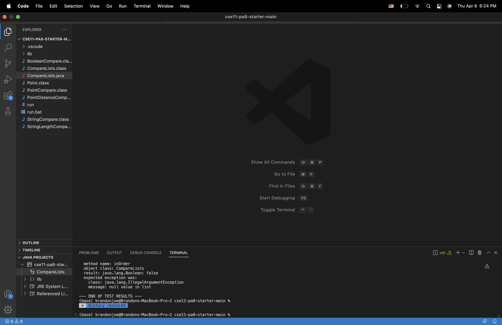
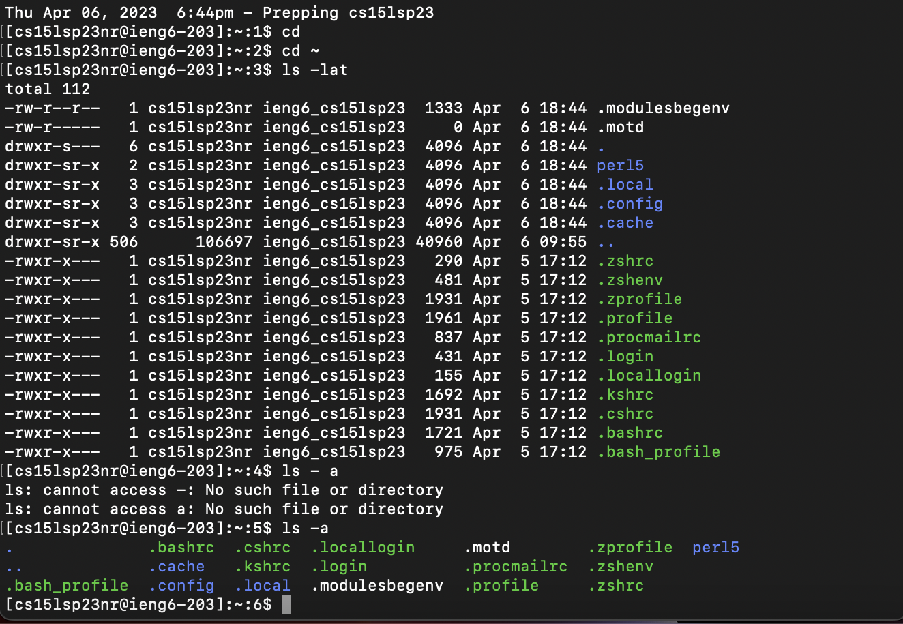

# Installing VScode

* I downloaded VSCode from the website: [Link](https://code.visualstudio.com/download)
* I clicked on the download SHEESH
* For other IDES, the difference is described by Miljenko Cvjetko (Quote below):

""

Visual Studio for Mac is successor of Xamarin.Studio and Xamarin.Studio was a combination of open source IDE MonoDevelop with closed-source add-ins for Xamarin.Android, Xamarin.iOS and Xamarin.Mac.

MonoDevelop is an open source, cross platform (xplat) IDE based on GTK#, so it can run on MacOSX, Linux and Windows, but that fact means that it is not native on Mac and Windows - it does not feel natural (a bit ugly) and slower.

MonoDevelop can be built to run on Linux, but a lot of features will be missing (speaking of 2019–05–31). user will have ability to build basic .NET Core Apps (Console and ASP.net Core).

Visual Studio for Mac is undergoing huge changes. It is being ported over from GTK# to AppKit (Mac native). For example in last few months Editors have been ported to use Mac native APIs.

Visual Studio for Windows relied a lot on COM technology and Windows specific APIs and this will be non trivial task to untangle that. OTOH most of the IDE GUI is WPF based and though there is WPF for .NET Core writing new rendering engine for non-windows platforms will also be non trivial task (WPF on Windows is DirectX based).

""

# Remotely Connecting

* Open Terminal
* Type your username ex. "ssh cs15lsp23nr@ieng6.ucsd.edu"
* Enter Password ex. uhhhh
* Prompts you if you want to connect to the server (Y/n), type "Y"

# Trying Some Commands

* Type in commands such as:
-`cd ~` - goes back to the root folder
-`cd` - change directory
-`ls -a` - lists files in directory
-`cp /home/linux/ieng6/cs15lwi23/public/hello.txt ~/` - copies a file
-`cat /home/linux/ieng6/cs15lwi23/public/hello.txt` - concatenates files

