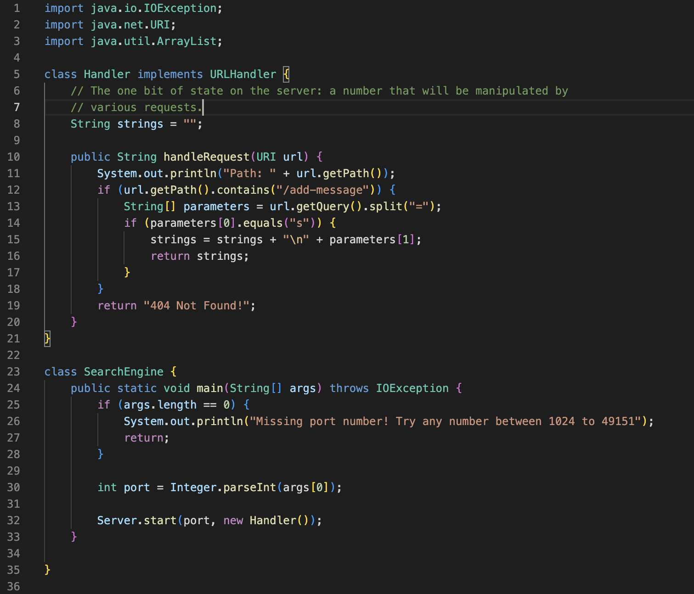
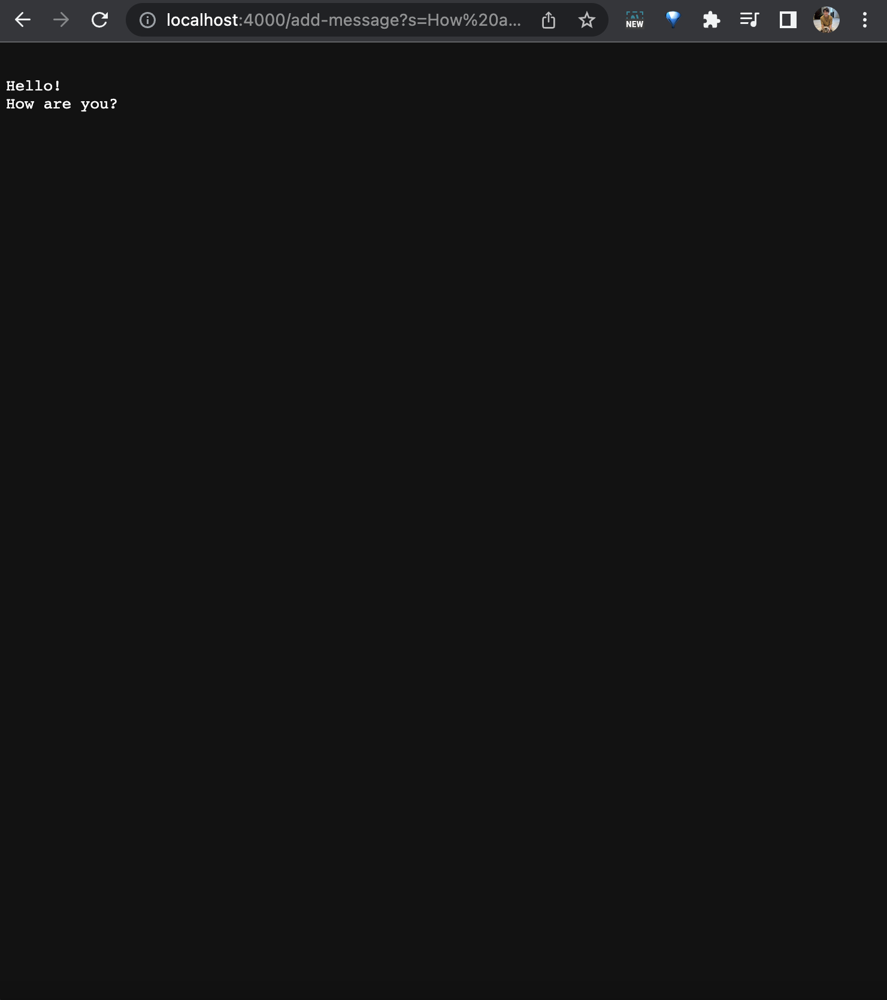
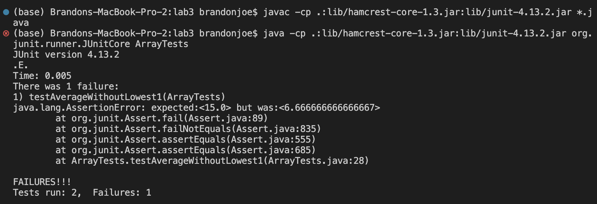

# Part 1: StringServer


## StringServer Code



### Which methods in your code are called?

I have one method in my code name "handleRequest." This method essentially checks whether the URL path contains "/add-message?s=[user inputted message]." If it does contain this, then it saves it into a string which is then displayed onto the page. Any more strings that are entered through /add-message?s=[iser inputted message] are then added below the first message in new lines. If the URL does not contain "/add-message?s=..." then the page shows "404 Not Found!"

### What are the relevant arguments to those methods, and the values of any relevant fields of the class?

The relevant argument is the string that is the URL. The values of the relevant fields of the class is returnedString, which saves all the inputted user words.

### How do the values of any relevant fields of the class change from this specific request? If no values got changed, explain why.

The values of the returnedString changes from this specific request because when the request is made, the new word gets concatenated with the previous words. 

## StringServer Test 1


## StringServer Test 2




# Part 2: Bug from lab3

### A failure-inducing input for the buggy program

```

  @Test
  public void testAverageWithoutLowest2() {
    double[] input1 = {5,5,10,10};
    assertEquals((double)15, ArrayExamples.averageWithoutLowest(input1),0);
  }

```

### An input that doesn’t induce a failure

```

  @Test
  public void testAverageWithoutLowest2() {
    double[] input1 = { 5,10};
    assertEquals((double) 10, ArrayExamples.averageWithoutLowest(input1), 0);
  }

```

### The symptom



### Before & After

Before

'''
  static double averageWithoutLowest(double[] arr) {
    if(arr.length < 2) { return 0.0; }
    double lowest = arr[0];
    for(double num: arr) {
      if(num < lowest) { lowest = num; }
    }
    double sum = 0;
    for(double num: arr) {
      if(num != lowest) { sum += num; }
    }
    return sum / (arr.length - 1);
  }
'''

After

'''
static double averageWithoutLowest(double[] arr) {
    if (arr.length < 2) {
      return 0.0;
    }
    double lowest = arr[0];
    for (double num : arr) {
      if (num < lowest) {
        lowest = num;
      }
    }
    double sum = 0;
    int count = 0;
    for (double num : arr) {
      if (num != lowest && count == 0) {
        sum += num;
        count++;
      }
    }
    return sum / (arr.length - 1);
  }

### Briefly describe why the fix addresses the issue.

The fix addresses the issue because the issue was because the way they excluded the lowest value. By using the code
'''
      if(num != lowest) { sum += num; }
'''
they do not account for duplicates of the lowest number. So to fix it, I essentially added a count which prevented it from excluding more than one of the lowest numbers.

## Something I learned from lab in week 2 or 3

I learned a lot from these labs such as running a locally hosted server, working with GitHub (cloning, forking, etc.), and adding code that reacts to the different user inputted URLs. Then for week 3, I learned how painful it is to debug and that Macs do not like running code for Windows.
