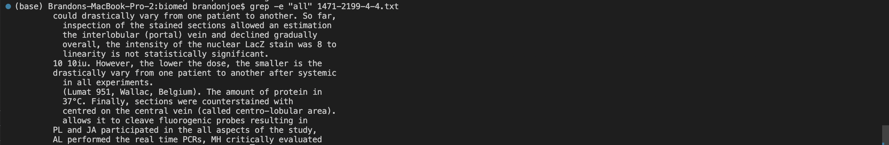
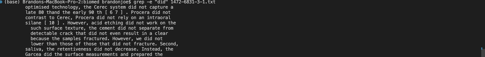
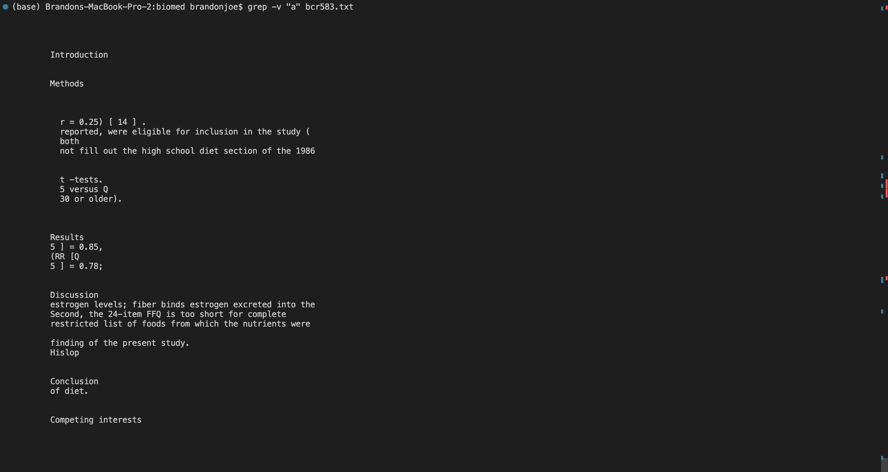
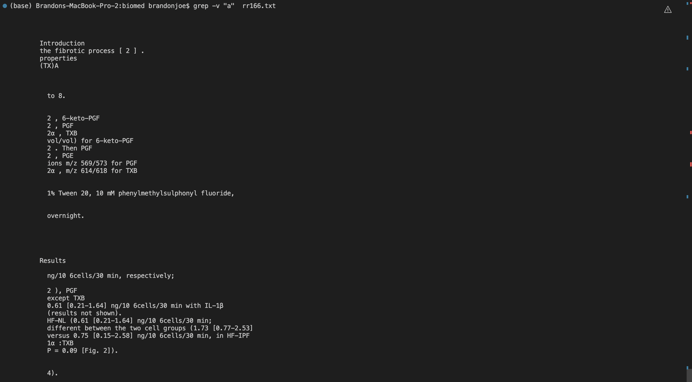
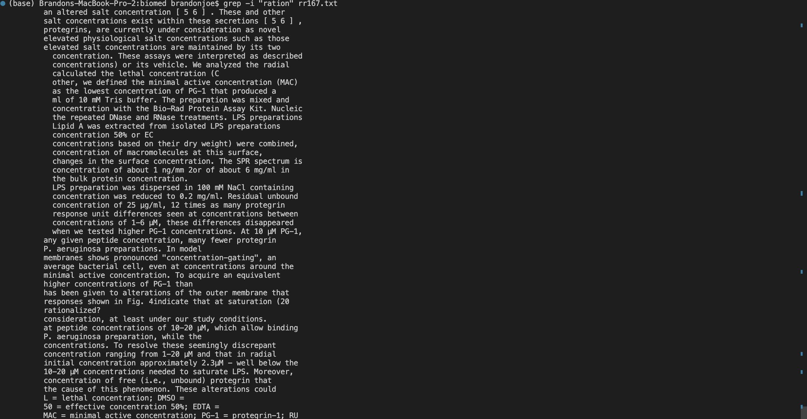
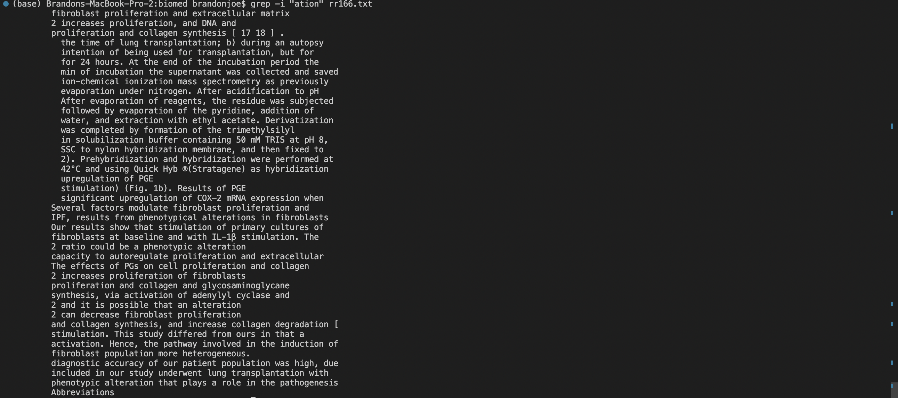

# Researching Commands - grep

**Grep Description** - print lines that match patterns

# grep -e

**-e Description** - Use PATTERNS as the patterns.  If this option is used
                     multiple times or is combined with the -f (--file) option,
                     search for all patterns given.  This option can be used to
                     protect a pattern beginning with “-”.

# grep -c

**-c Description** - Suppress normal output; instead print a count of matching
                     lines for each input file.  With the -v, --invert-match
                     option (see above), count non-matching lines.

# grep -v

**-v Description** - Invert the sense of matching, to select non-matching
                     lines.

# grep -i

**-i Description** - Ignore case distinctions in patterns and input data, so
                     that characters that differ only in case match each other.

# Citation

[https://man7.org/linux/man-pages/man1/grep.1.html](https://man7.org/linux/man-pages/man1/grep.1.html)
