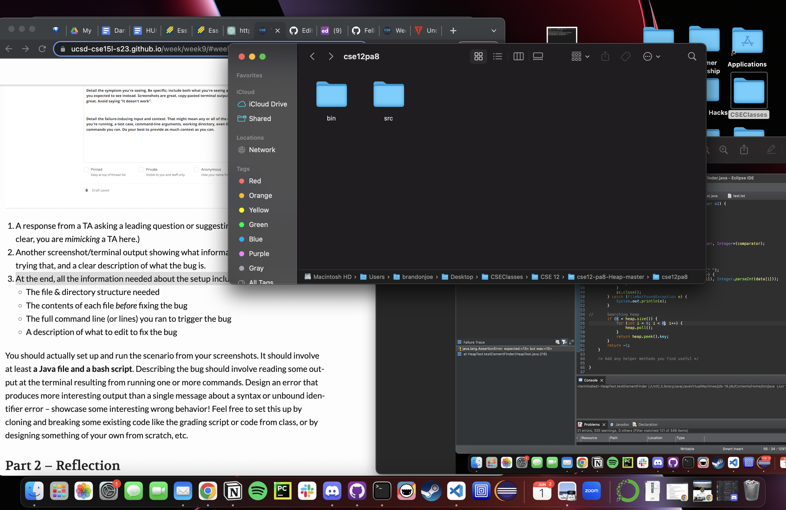
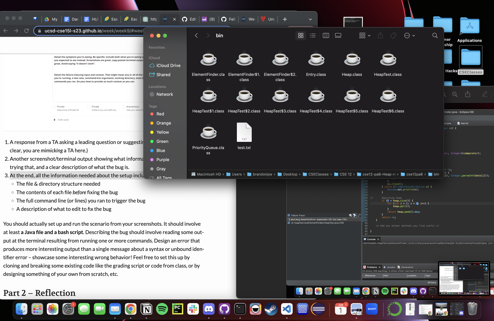
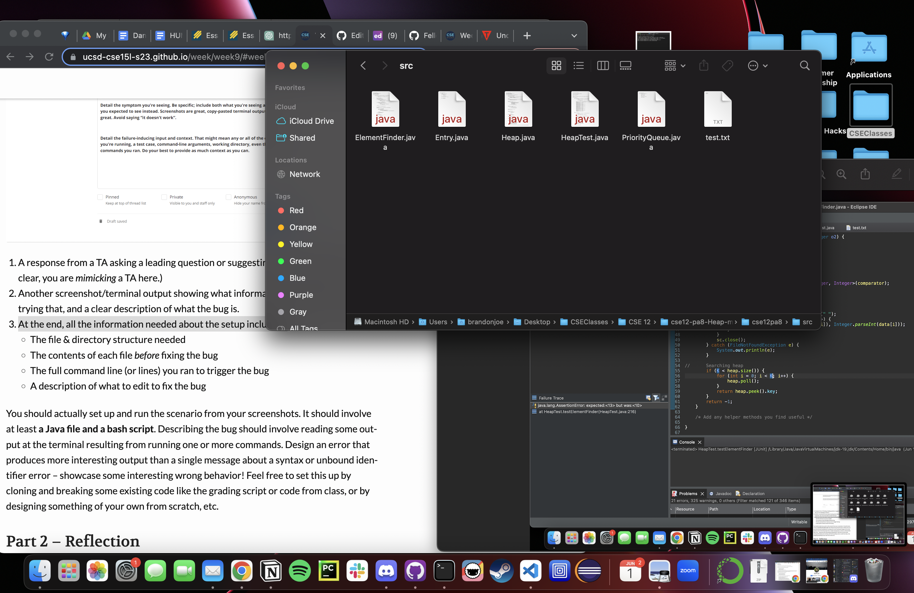
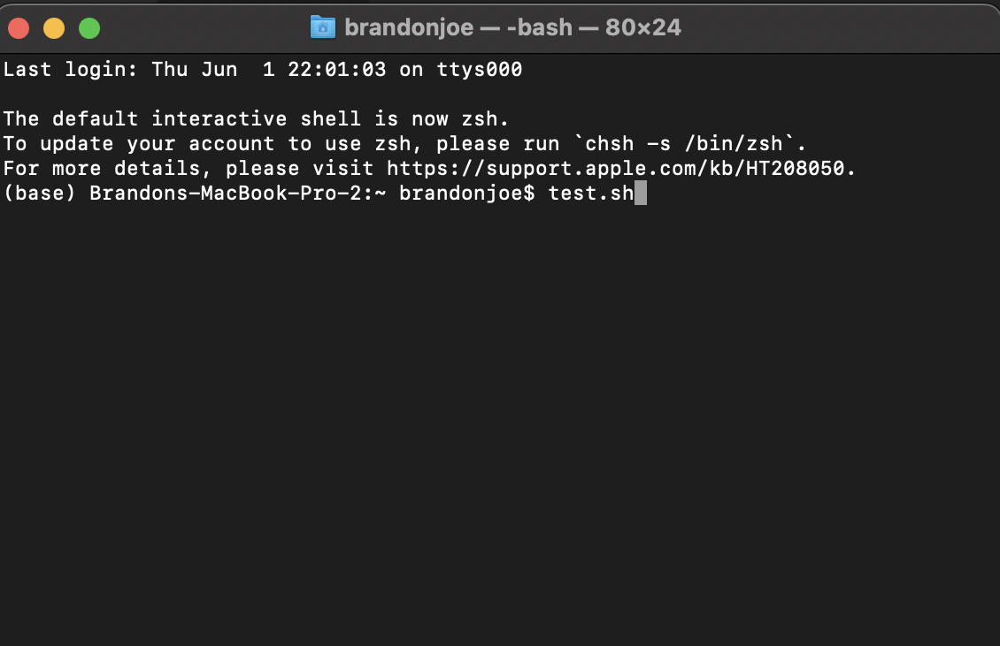

# Lab Report 5

### Student Question

===== My Code For ElementFinder =====

**What environment are you using (computer, operating system, web browser, terminal/editor, and so on)?**

Mac, M1, eclipse, junit

**Detail the symptom you're seeing. Be specific; include both what you're seeing and what you expected to see instead. Screenshots are great, copy-pasted terminal output is also great. Avoid saying “it doesn't work”.**

The code is returning 10 when it should be returning 13 for the heap. 

===== The Testing Code =====

**Detail the failure-inducing input and context. That might mean any or all of the command you're running, a test case, command-line arguments, working directory, even the last few commands you ran. Do your best to provide as much context as you can.**

The input in the method is the 4th largest value. Specifically, the inputs I put in were "src/test.txt", "4", and "largest." The test I used to test the ElementFinder object is noted in the image above

### TA Response

Did you manually trace the code? I would go through everyline and with your theoretical variables and map out what happens throughout the code.

### Student Retry

It seems like the bug was forgetting K - 1 for the bound (second argument) in the for loop on line 56. Thank you!

### All the information needed about the setup including:

**File & Directory Structure**

**Contents of the File Before Fixing**

**The full command line (or lines) you ran to trigger the bug**

**A description of what to edit to fix the bug**

To fix the bug, I added - 1 to bound K (second argument for the for loop) on line 56

# Reflection

One of the things I learned from my lab experience in the second half of the quarter was VIM. I had a lot of fun working with it and exploring the hotkeys. I'm very much an efficiency lover so this section tickled my fancy. I also started messing around with the customizations and I think I'll try exploring a little more this summer and perhaps use it for future CSE classes, who knows! Also, thank you TAs for helping me use VIM without my escape key lol, it broke so they taught me an alternative.
