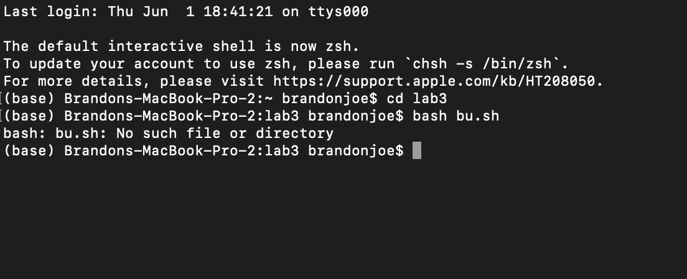
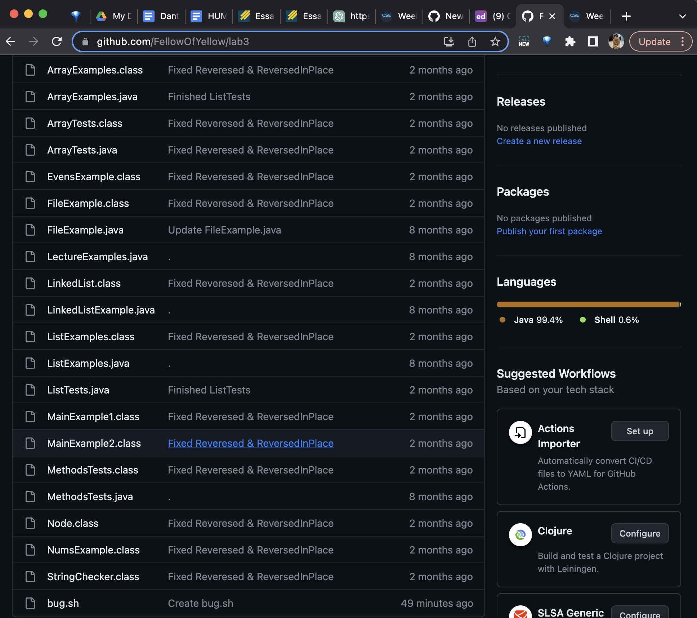

# Lab Report 5

### Student Question

**What environment are you using (computer, operating system, web browser, terminal/editor, and so on)?**

Mac, bash

**Detail the symptom you're seeing. Be specific; include both what you're seeing and what you expected to see instead. Screenshots are great, copy-pasted terminal output is also great. Avoid saying “it doesn't work”.**

Code is not running because it does not exist. This is git containing all the files:

**Detail the failure-inducing input and context. That might mean any or all of the command you're running, a test case, command-line arguments, working directory, even the last few commands you ran. Do your best to provide as much context as you can.**

I'm running the bash command to run the file. I'm trying to run the file which should be working with bash but it cannot run

### TA Response

Did you try to make sure that you had no typos? Try using tab in order to auto complete to avoid typos

### Student Retry

It seems like the bug was a misspelling of the bug.sh file. Thank you for helping!

